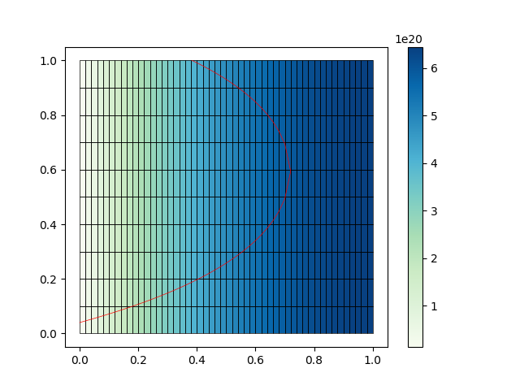

# RayTracer
A c++ code written for a diploma thesis at [FNSPE CTU](https://www.fjfi.cvut.cz/en/).
The goal is to simulate a laser-plasma interaction using the geometric approximation.
The main focus is on usage with hydrodynamic simulations. Specifically simulations of plasma
used as a gain medium for x-ray laser generation. Using RayTracer, both the plasma generation
using a driving laser and x-ray lasing can be simulated. 

## Reading the docs
[//]: # (TODO expand this when the docs are coplete)

## Building and installing

### Dependencies
The project uses [CMake](https://cmake.org/) and is developed with **only cmake users**
in mind.
 
Beside that it depends on multiple libraries. These are divided into two categories:
**small** libraries which are build during cmake configure and **large** libraries which
need to be installed by the user.

The **small** libraries are:
[Google Test](https://github.com/google/googletest),
[msgpack](https://github.com/msgpack/msgpack-c/tree/cpp_master) and
[jsoncpp](https://github.com/open-source-parsers/jsoncpp). As previously mentioned,
these will be built during cmake configure and no further action is required from
the user.

The project also depends on **large** libraries, namely:
[Boost headers](https://www.boost.org/) and
[mfem](https://mfem.org/). These must be provided by the user, as they take way too much time to compile,
meaning they must be installed at the users system in a location known to cmake.

On ubuntu based systems (and similarly on other systems) you can install boost using
```shell
sudo apt-get install libboost-all-dev
```

Mfem must be installed manually. The basic commands to install mfem are:
```shell
git clone https://github.com/mfem/mfem &&
mkdir mfem_build &&
cd mfem_build &&
cmake -DCMAKE_INSTALL_PREFIX=<install_dir> ../mfem &&
make install
```
Do not use `-DCMAKE_INSTALL_PREFIX=<install_dir>` if you want to install
to default directory, otherwise provide an `<install_dir>`.

### Build and install
Choose a build type, the options are `Debug` and `Release`.
If mfem and boost are not present at the default locations, point cmake to them using 
`-DCMAKE_PREFIX_PATH=<dep_directory>`. If you want to install to non standard location
provide `<install_dir>` otherwise omit this option. To see the full list of options
see [CMake config](docs/markdown/cmake.md).

Altogether, to download, build and install the project using cmake, run:
```shell
git clone https://github.com/SachCZ/raytracer &&
mkdir raytracer_build &&
cd raytracer_build &&
cmake -DCMAKE_BUILD_TYPE=<build_type> -DCMAKE_PREFIX_PATH=<dep_directory>\
-DCMAKE_INSTALL_PREFIX=<install_dir> &&
make install
```

## Usage in your project
To use raytracer library in your cmake project simply call use a CMakeLists.txt
similar to this:
```cmake
cmake_minimum_required(VERSION 3.11)
project(executable_using_raytracer)

find_package(raytracer)

set(CMAKE_CXX_STANDARD 14)

add_executable(main main.cpp)
target_link_libraries(main raytracer::raytracer)
```

And finaly to write some code using raytracer, include the header in your sources:
```c++
#include <raytracer.h>
...
```

## A minimal example
Here is a short sample code demonstrating how to use raytracer to trace as single ray in
media with electron density profile in x direction:

<p align="center">
  
</p>

```c++
#include <raytracer.h>

int main(int, char *[]) {
    using namespace raytracer;

    MfemMesh mesh(SegmentedLine{1.0, 50}, SegmentedLine{1.0, 10});
    MfemL20Space space{mesh};

    Length wavelength{1315e-7};

    MfemMeshFunction density(space, [&wavelength](Point point) {
        return calcCritDens(wavelength).asDouble * (1 - std::pow(point.x-1, 2));
    });
    MfemMeshFunction refractIndex(space, [&density, &wavelength](const Element& e){
        return calcRefractIndex(density.getValue(e), wavelength, 0);
    });

    LinInterGrad gradient(calcHousGrad(mesh, density));
    SnellsLaw snellsLaw(gradient, refractIndex);
    auto intersectionSet = findIntersections(
            mesh,
            {Ray{{-0.1, 0.01}, Vector{1, 0.3}}},
            snellsLaw,
            intersectStraight,
            dontStop
    );
    
    std::ofstream trajectoryFile("trajectory.msgpack");
    trajectoryFile << stringifyRaysToMsgpack(intersectionSet);
    std::ofstream meshFile("mesh.mfem");
    meshFile << mesh;
    std::ofstream densityFile("density.gf");
    densityFile << density;
}
```
So what does it do? First a rectangular mesh with 50 segments in _x_ and 10 segments in _y_
is generated. This mesh is used to initialize an MfemL20Space (this is needed by MfemMeshFunction).
```c++
    MfemMesh mesh(SegmentedLine{1.0, 50}, SegmentedLine{1.0, 10});
    MfemL20Space space{mesh};
``` 
Next a constant wavelength is set and two MfemMeshFunctions 
representing density and refractive index are initialized. Refractive index is calculated
using the density MfemMeshFunction. You can initialize MfemMeshFunction using a function
taking in Element or Point as param and returning a value of type double.

```c++
    Length wavelength{1315e-7};
    
    MfemMeshFunction density(space, [&wavelength](Point point) {
        return calcCritDens(wavelength).asDouble * (1 - std::pow(point.x-1, 2));
    });
    MfemMeshFunction refractIndex(space, [&density, &wavelength](const Element& e){
        return calcRefractIndex(density.getValue(e), wavelength, 0);
    });
```

Next a method used to calculate density gradient is prepared. Here a gradient is calculated
by lineary interpolating a gradient at points of the mesh. Gradient at mesh points is 
obtained using the least squares householder factorization.

```c++
    LinInterGrad gradient(calcHousGrad(mesh, density));
``` 

Finally a function determining direction taken at element interface must be provided.
In this case it is a Snell's law:
```c++
   SnellsLaw snellsLaw(gradient, refractIndex);
```

To actually perform the computation a function called `findIntersections` is used.
Here we tell it to find intersections with `mesh` starting from a single ray originating
at point `(-0.1, 0.01)` in direction `(1, 0.3)`. It is instructed to use Snell's
law at each interface of two elements it encounters (not at a border) and intersect
each element using a straight line. Last parameter `dontStop` just says that
there is no special condition to end the ray tracing.
```c++
    auto intersectionSet = findIntersections(
            mesh,
            {Ray{{-0.1, 0.01}, Vector{1, 0.3}}},
            snellsLaw,
            intersectStraight,
            dontStop
    );
```
This function returns an IntersectionsSet. That is something like this:
```c++
    intersectionSet = {{Intersection, Intersection ...}, {... second ray ...}, ...};
```

In the end dump everything necessary for plotting to files. This is straight forward.
Only exception is the trajectory file which has a special
[messagepack](https://msgpack.org/index.html) format.
```c++
    std::ofstream trajectoryFile("trajectory.msgpack");
    trajectoryFile << stringifyRaysToMsgpack(intersectionSet);
    std::ofstream meshFile("mesh.mfem");
    meshFile << mesh;
    std::ofstream densityFile("density.gf");
    densityFile << density;
``` 

When the sample is run, it generates three files: `density.gf`, `mesh.mfem`, `trajectory.msgpack`.
These results can be plotted in a single plot using a simple python scrip `plot_trajectory.py`:
```python
import rayvis
from matplotlib import pyplot as plt


if __name__ == '__main__':
    with open("mesh.mfem") as f:
        mesh = rayvis.read_mfem_mesh(f)
    with open("trajectory.msgpack", "rb") as f:
        rays = rayvis.read_msgpack_rays(f)
    with open("density.gf") as f:
        density = rayvis.read_grid_function(f, mesh)
    fig, axes = plt.subplots()
    poly_collection = rayvis.plot_grid_function(axes, density, cmap="GnBu")
    fig.colorbar(poly_collection)
    rayvis.plot_mesh(axes, mesh, linewidth=0.5)
    rayvis.plot_rays(axes, rays, linewidth=0.5, color="red")
    plt.show()
```

This script uses the rayvis plotting library developed in parallel with raytracer.
It enables easy visualization of data. To learn about rayvis refer to
[rayvis GitHub repository](https://github.com/SachCZ/rayvis). Assuming the script
is run from the same folder the rayvis generated files reside in, you can simply do:
```shell
python3 plot_trajectory.py
``` 
This will produce the following result



## API documentation
There is also doxygen generated api documentation.
It is hosted [here](https://sachcz.github.io/raytracer).
