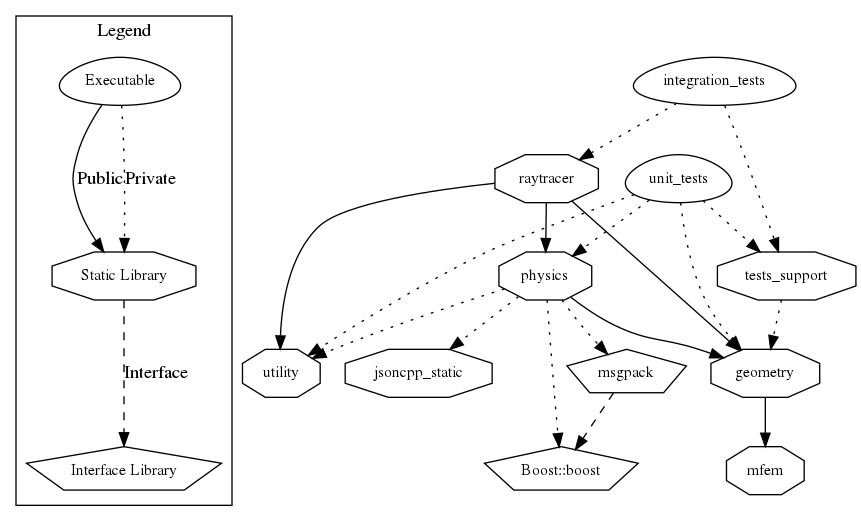

# CMake config

RayTracer uses cmake to configure the build and install. In this document
options intended to be used by a user are listed and overall structure
of the project is summarized.

## CMake options
Options expected to be used by the user of RayTracer are:

- -DCMAKE_BUILD_TYPE=<Debug/Release>
- -DCMAKE_PREFIX_PATH=<dep_directory>
- -DCMAKE_INSTALL_PREFIX=<install_dir>
- -DRAYTRACER_BUILD_TESTS=<ON/OFF>
- -DRAYTRACER_COMPILE_COVERAGE=<ON/OFF>
- -DRAYTRACER_BUILD_PROFILE=<ON/OFF>

Make sure to always provide a build type, either _debug_ or _release_. Prefixes set
the directories searched by cmake and installed to by cmake. RayTracer specific
options are all `OFF` by default. If `RAYTRACER_BUILD_TESTS` is `ON`,
tests in directory `tests` are built. Option `RAYTRACER_BUILD_TESTS` globaly
sets the compiler and linker flags necessary to generate coverage information
using g++. Option `DRAYTRACER_BUILD_PROFILE` will instruct cmake to configure
targets in directory `profile`.

## Project structure
Whole RayTracer project is divided into three libraries: gemometry, physics and utility.
Moreover it depends on other external libraries. Together they are linked to the
target raytracer, the only thing you as a user need to care about. The three libraries
further depend on external libraries. All the mentioned dependenscies are summarized
in the following image:

 